# Portfólio

| :placard: Vitrine.Dev | Othon Santos da Silva |
| -------------  | --- |
| :sparkles: Name        | **Portfólio**
| :label: Technologies | HTML, CSS, PHP, JavaScript, Bootstrap e PHPMailer
| :bulb: Skills        | Posicionamento de elementos, Animações, Layout Resposivo e POO
| :rocket: URL         | https://othonss.epizy.com/


# Portfólio 
<p>
  Um site portfólio para demonstrar meus conhecimentos e interesses na área de desenvolvimento, desenvolvido por mim com HTML5, CSS3, JavaScrit, Bootstrap, PHP e PHPMailer.
</p>

<p>
  No site encontra-se alguns trabalhos desenvolvidos durante cursos online realizados na Udemy e no Youtube.
  Como não possuo experiência na área, sem ser acadêmica, o site me serviu como uma maneira de demonstrar os conhecimentos sobre desenvolvimento web que possuo. <br>
  A intenção está além de só demonstrar meus conhecimentos, mas também de ganhar, através de alguma oportunidade de trabalho.
</p>

<p>
  O site contém projetos envolvendo conteúdos sobre posicionamentos de elementos, layouts fixos, líquidos e reponsivos, com CSS Grid e Flexbox e também com o framework Bootstrap.
</p>
<p>
    Contém também projetos envolvendo Javascript e backend com PHP e MySQL. Projetos que por sua vez foram essenciais para complementar meus estudos com desenvolvimento web.
</p>

<p>
  Este portfólio foi inteiramente pensado em ser atrativo e uma porta de entrada para eu poder apresentar o que eu sei em uma possível proposta de trabalho.   
</p>


## Layout web

### Página inicial
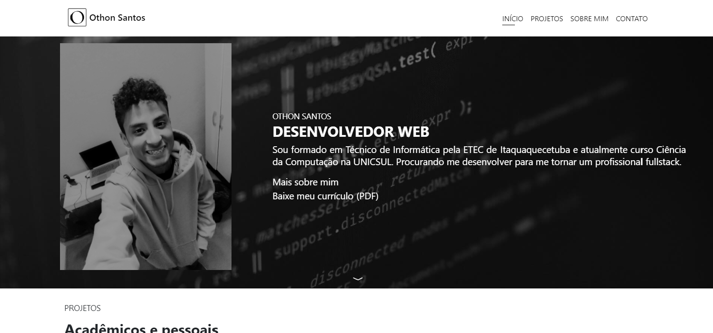
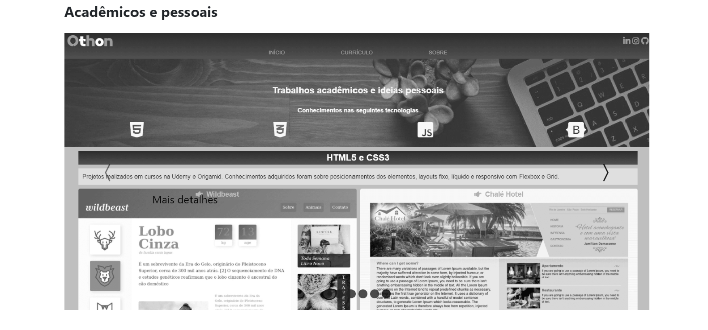

### Página de projetos
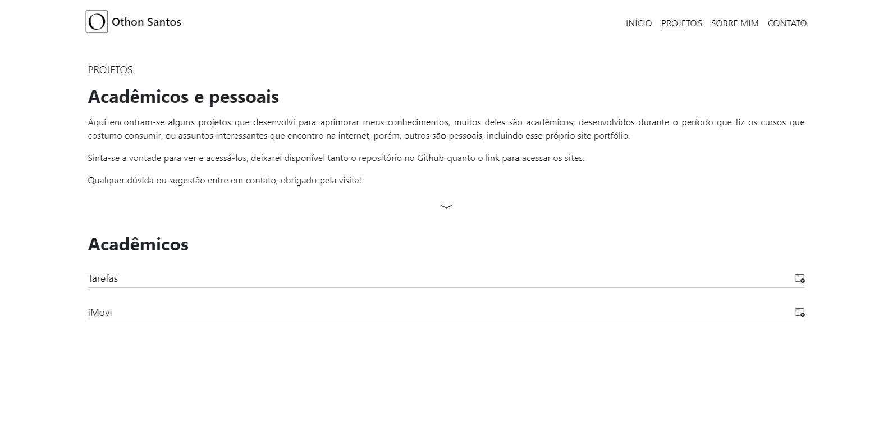
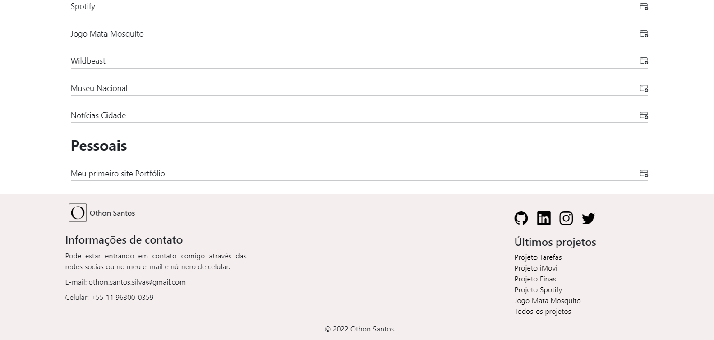

### Página sobre mim
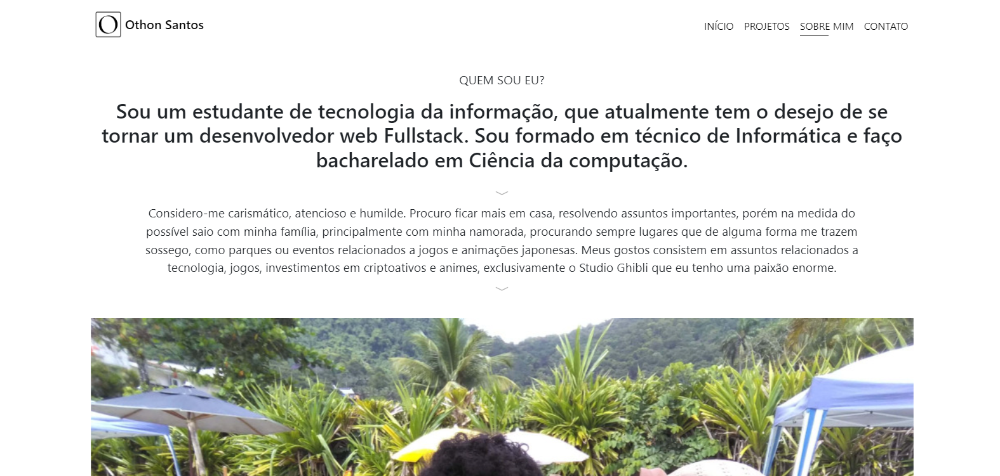
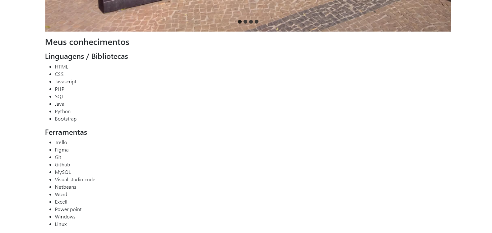

### Página de contato
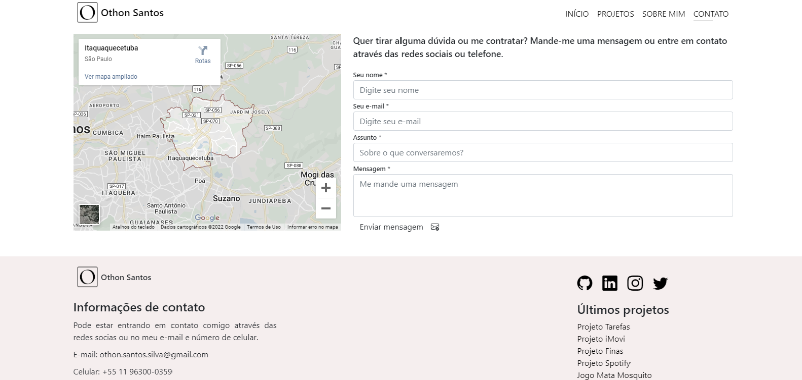

## Layout mobile

### Página inicial
<div style="display: flex;">
  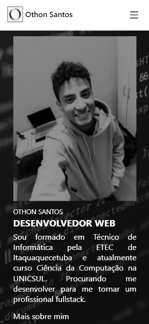
  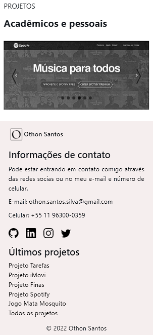
</div>

### Página de projetos
<div style="display: flex;">
  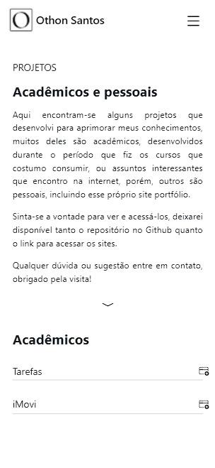
  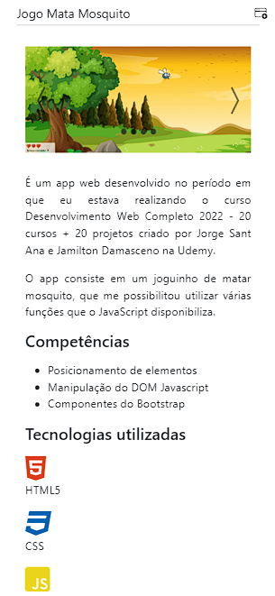
  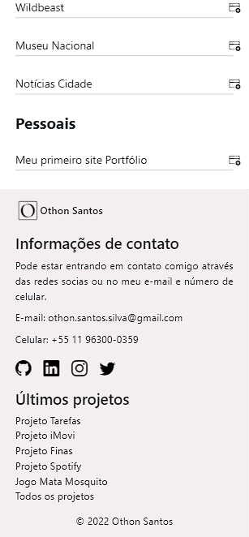
</div>

### Página sobre mim
<div style="display: flex;">
  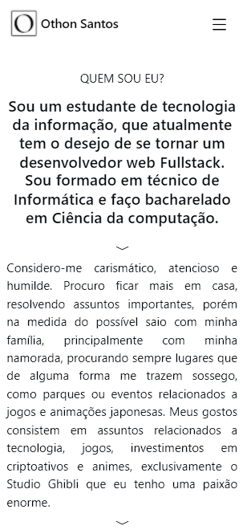
  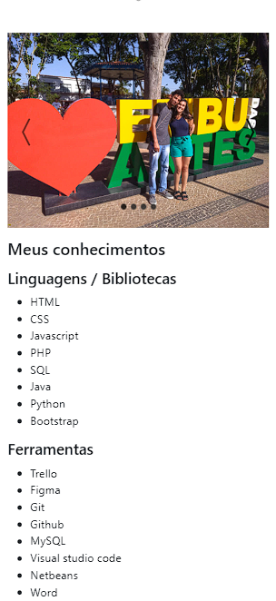
</div>

### Página de contato
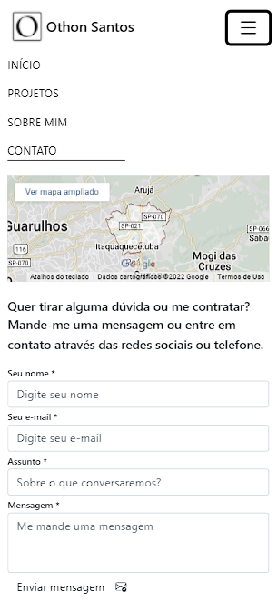

## Como executar o projeto

Instruções para executar o app

## Back-end
Pré-requisitos: Servidor Apache (XAMPP)

Clonar repositório

```bash
  https://github.com/othonss/Portfolio
```
Copiar para dentro da pasta htdocs (caso XAMPP)

<strong>*Se faz necessário a inclusão de um e-mail e senha no arquivo processa_envio.php</strong>
<p>Substituindo os textos "exemple @ example. com" para um e-mail válido e "yourpassword" para a senha do e-mail, consulte a documentação do PHPMailer para mais informações.</p>

## Front-end
Pré-requisitos: Navegador

Editar com IDE ou Editor de preferência.

Acessar utilizando navegador de preferência.

## Autor 

Othon Santos da Silva

<a href="https://www.linkedin.com/in/othon-santos-35531b129/" target="_blank">
    
</a>

